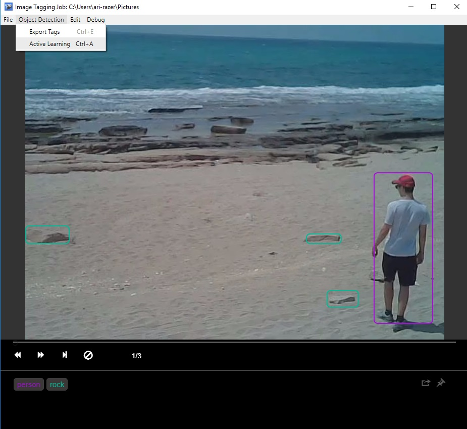
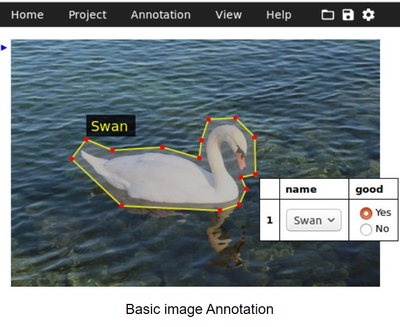

# Machine-Learning-Annotation-Tools
Annotation Tools for Machine Learning / Deep Learning

# Computer Vision

1. Visual Object Tagging Tool (Microsoft)

https://github.com/Microsoft/VoTT

- Object Detection
- Image, Video
- CNTK, Tensorflow (PascalVOC), YOLO
- MIT

2. LabelImg

https://github.com/tzutalin/labelImg

- Object Detection
- Tensorflow (PascalVOC), YOLO
- MIT

3. SuperVisely

https://supervise.ly/

- Object Detection, Image segmentation
- Image
- Community (free), business and Enterprise

4. VGG Image Annotator (VIA)

http://www.robots.ox.ac.uk/~vgg/software/via/

- Object Detection, Image segmentation
- Image
- License (https://gitlab.com/vgg/via/blob/master/LICENSE)

# Text

1. doccano

https://github.com/chakki-works/doccano

- Text classification, sequence labeling and sequence to sequence
- Named Entity Recognition
- Sentiment analysis
- Machine translation
- CSV, JSON
- MIT

# Links

- Wikipedia - List of manual image annotation tools
https://en.wikipedia.org/wiki/List_of_manual_image_annotation_tools
